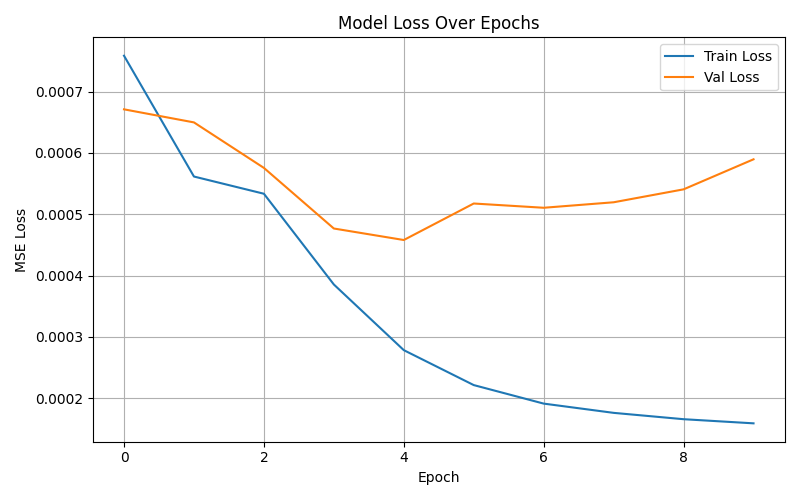
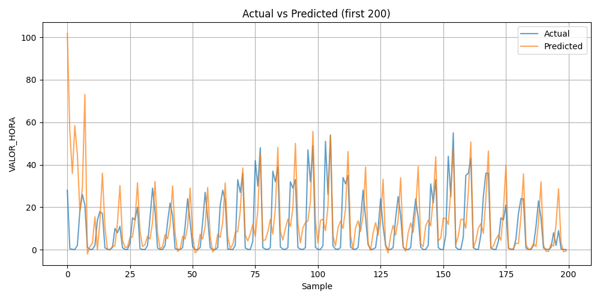
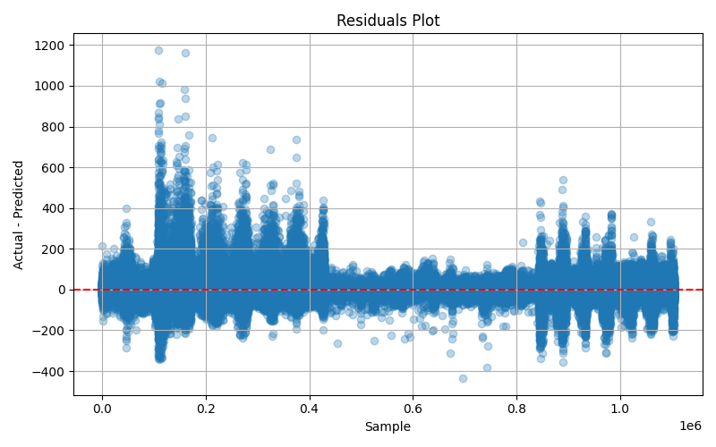
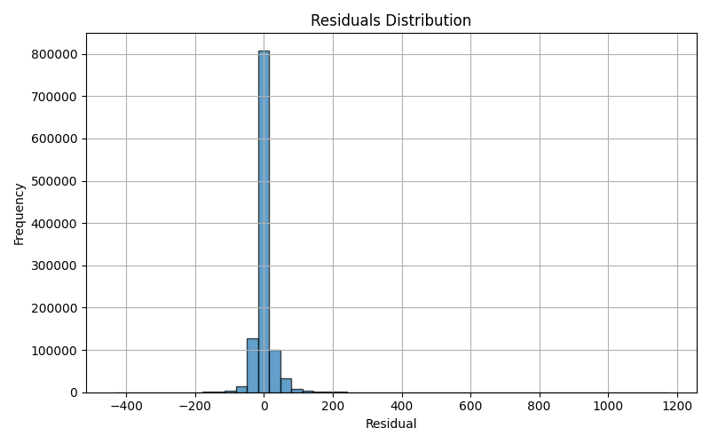
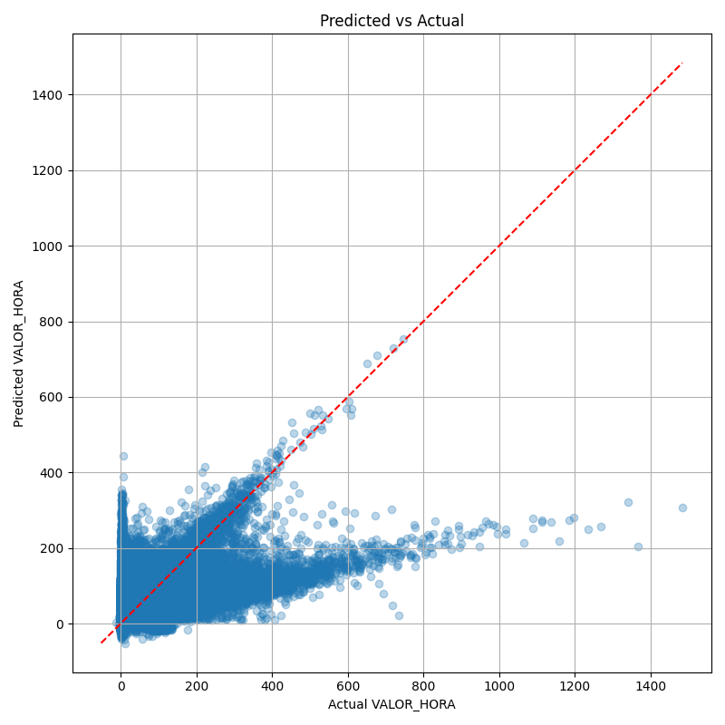

# ------------------------------------------------------------
# 1. Descripción general
# ------------------------------------------------------------

Este proyecto **automatiza** el proceso completo para predecir la concentración
horaria de contaminantes atmosféricos en la ciudad de Madrid:

1. **Descarga** y **procesado** de datos brutos de calidad del aire y
   meteorología publicados por el Ayuntamiento.
2. **Limpieza**, fusión y **feature-engineering** para crear un dataset
   multivariante listo para modelos de series temporales.
3. Entrenamiento de una **LSTM** (TensorFlow/Keras) con soporte GPU.
4. Generación de **métricas y gráficos** de evaluación.

Las rutas se basan en la carpeta raíz `AI/` (configurable en
`data_pipeline.py` y en `train_mod.py`).

PORFAVOR CAMBIAR LAS RUTAS ANTES DE EJECUTAR EL CÓDIGO.


---

# ------------------------------------------------------------
# 2. Estructura de carpetas
# ------------------------------------------------------------
>content/
>├─ input/ ← ZIPs y CSVs originales
>│ ├─ aire/
>│ └─ meteo/
>├─ output/
>│ ├─ transformado_aire*/ ← aire long + limpio
>│ ├─ transformado_meteo*/ ← meteo long → pivot → limpio
>│ ├─ dataset_combinado_final.csv
>│ └─ dataset_listo_para_entrenar.csv
>├─ stations/ ← metadatos + mapping
>├─ graphs/ ← figuras y métricas de entrenamiento
>├─ data_pipeline.py
>└─ train_mod.py

---

# ------------------------------------------------------------
# 3. `data_pipeline.py` — paso a paso
# ------------------------------------------------------------

| Paso | Función / bloque | Acción principal | Motivo |
|-----:|------------------|------------------|--------|
| 0 | setup | Logging, rutas y sesión HTTP con reintentos. | Visibilidad y robustez frente a fallos de red. |
| 1 | `download_and_extract` | Descarga ZIPs y extrae CSVs a `input/`. | Datos locales siempre disponibles. |
| 2 | `transform_wide_to_long` | Convierte columnas **H01–H24** / **V01–V24** a formato *long*. | Facilita filtros y merges posteriores. |
| 3a | `pivot_meteo` | Pivota meteo por **MAGNITUD** (ancho). | Una fila = todas las variables meteo. |
| 3b | `remove_magnitude(80)` | Elimina la magnitud 80 (sin datos). | Menos ruido y tamaño. |
| 4 | `drop_columns` & `filter_and_clean` | Quita columnas irrelevantes y conserva solo registros validados (`V`). | Mejora calidad del dataset. |
| 5a | `download_stations` | Descarga CSV de estaciones aire + meteo. | Necesarios para geolocalizar. |
| 5b | `build_station_mapping` | Convierte DMS→decimal y mapea cada estación de aire a su estación meteo más cercana. | Permite fusionar fuentes heterogéneas. |
| 6 | `combine_datasets` | Une contaminantes + meteo por fecha-hora y mapping. | Crea dataset unificado. |
| 7 | `prepare_for_training` | Limpieza final, imputación (3 niveles) y flags de nulos. | Dataset coherente y trazable. |
| 8 | `feature_engineering` | Features cíclicas (hora, mes, DOW, DOM) + OHE de contaminante. | Captura estacionalidad y periodicidad. |
| main | bloque `__main__` | Orquesta todos los pasos con *guard-clauses* para evitar trabajo repetido. | Ejecución única con `python data_pipeline.py`. |

---

# ------------------------------------------------------------
# 4. `train_mod.py` — paso a paso
# ------------------------------------------------------------

| Paso | Código | Acción | Motivo |
|-----:|--------|--------|--------|
| A | `configure_gpu()` | Mixed-precision + XLA + crecimiento dinámico de memoria (GPU). | +Velocidad −Memoria. |
| B | `load_and_preprocess` | Lee dataset, separa target, normaliza (MinMax) y divide 80/20. | Preprocesado estándar para LSTM. |
| C | `TimeseriesGenerator` | Crea ventanas deslizantes de **24 h**. | Contexto de un día para cada predicción. |
| D | `build_model` | LSTM(64) → Dropout 0.2 → Dense(1). | Arquitectura compacta y eficaz. |
| E | Entrenamiento | `EarlyStopping(patience=5)` + `ModelCheckpoint`. | Evita overfitting y guarda mejor modelo. |
| F | Evaluación | Inversión del escalado → MAE, RMSE, MAPE, R². | Métricas clásicas de regresión. |
| G | `plot_and_save` | Guarda 5 gráficos + `metrics.txt` en `graphs/`. | Análisis visual y reproducibilidad. |

> Ejecuta con  
> `python train_mod.py`  
> (usará GPU si está disponible).

---

# ------------------------------------------------------------
# 5. Requisitos
# ------------------------------------------------------------

| Paquete |
|--------------------------|
| Python 3.10 osuperior |
| numpy, pandas, tqdm |
| scikit-learn ≥ 1.3 |
| geopy, requests, urllib3 |
| TensorFlow ≥ 2.15 (GPU) |
| matplotlib |

---

# ------------------------------------------------------------
# 6. Ejecución rápida
# ------------------------------------------------------------

```bash
# 1. Procesamiento / ETL (una sola vez):
python data_pipeline.py

# 2. Entrenamiento LSTM:
python train_mod.py
```

# ------------------------------------------------------------
## 7. Resultados y gráficos

### 7.1 Métricas finales

| MAE | RMSE | MAPE | R² |
|-----|------|------|----|
| **15.2633** | **28.6988** | **24.78 %** | **0.4186** |


---

### 7.2 Gráficos generados

| Archivo | Descripción | Vista rápida |
|---------|-------------|--------------|
| `content/graphs/training_history.png`         | Pérdida *train* vs *val* por época |  |
| `content/graphs/actual_vs_predicted.png`      | Valores reales vs predichos (primeros 200) |  |
| `content/graphs/residuals_scatter.png`        | Residuos vs índice |  |
| `content/graphs/residuals_hist.png`           | Histograma de residuos |  |
| `content/graphs/pred_vs_actual_scatter.png`   | Dispersión predicho vs real |  |

